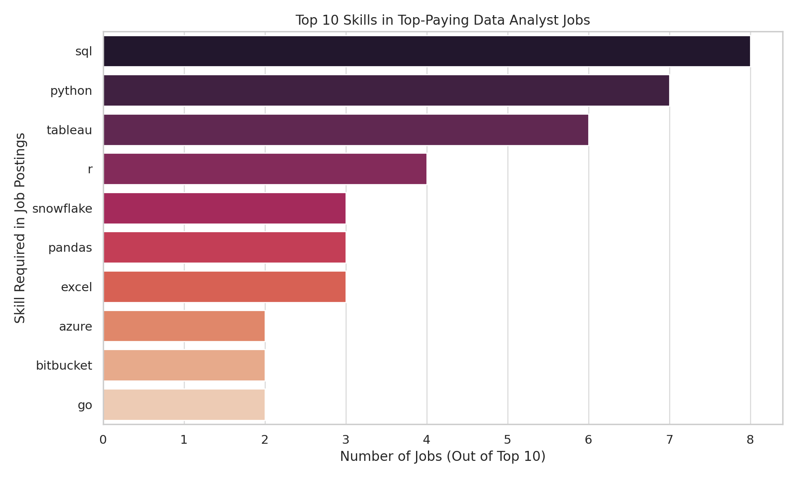

# 📊 SQL Job Market Analysis

##  Introduction

 Dive into the data job market! Focusing on data analyst roles, this project explores 💰 top-paying jobs, 🔥in-demand skills, and ✅ where high demand meets high salary in data analytics.

 SQL queries? Check them out here: [`project_sql`](./project_sql/)

## ❓ Questions Answered

1. What are the top-paying data analyst jobs?
2. What skills are required for these top-paying jobs?
3. What skills are most in demand for data analysts?
4. Which skills are associated with higher salaries?
5. What are the most optimal skills to learn?

## 📚 Background

This project was born from a desire to better understand the data analyst job landscape—what pays best, what’s in demand, and what tools are worth learning. Data sourced from [Luke Barousse’s SQL course](https://lukebarousse.com/sql) gives insight into job titles, salaries, and more.

## 🛠 Tools I Used

- **SQL:** Core tool for querying job market data.
- **PostgreSQL:** DBMS used for executing and testing queries.
- **Visual Studio Code:** IDE for writing clean, modular SQL.
- **Git & GitHub:** Version control and collaboration.

---

## 📈 The Analysis

### 1. Top Paying Data Analyst Jobs


####  Key Insights: Highest Paying Roles in the Market (2025)

-  The **highest-paying data roles** tend to include **"Director"**, **"Principal"**, or **"Lead"** in the title   reflecting seniority and decision-making responsibility.
-  Titles like **“Associate Director - Data Insights”** and **“Principal Business Intelligence Analyst”** command well over **$200,000–$600,000/year**, showing that strategy-focused analysts are in high demand.
-  The term **“Business Intelligence”** shows up repeatedly  BI Analysts and BI Engineers are climbing the salary ladder in 2025.
-  Specialized titles (e.g. **"Analytics Engineer"**, **"Data Modeler"**) show that hybrid tech-strategy skills are rewarded handsomely.
-  All roles were **remote**, proving that companies are fully on board with hybrid teams  even at the leadership level.

These insights show that **technical analysts who can also lead, model, and drive business outcomes** are cashing in the most.

#### 📊 Visualization : Top Paying Roles


The chart below highlights the **top-paying data analyst roles**, focusing on salary averages for remote positions.


---
```sql
SELECT 
    job_id,
    job_title,
    job_location,
    job_schedule_type,
    salary_year_avg,
    job_posted_date,
    name AS company_name
FROM 
    job_postings_fact
LEFT JOIN 
    company_dim ON job_postings_fact.company_id = company_dim.company_id
WHERE 
    job_title_short = 'Data Analyst' AND
    job_location = 'Anywhere' AND
    salary_year_avg IS NOT NULL
ORDER BY 
    salary_year_avg DESC
LIMIT 10;

```
---

### 2. Skills for Top Paying Roles 
Skill Frequency Insights (2025 Edition)
Here’s the breakdown of the most demanded skills for data analysts based on the top-paying jobs dataset:

- SQL is leading the pack with a strong count of 8 ,it's still the MVP of data analysis.
- Python follows closely with a count of 7, making it essential for automation and modeling.
- Tableau holds solid ground with a count of 6 , visualization is non-negotiable.
- Other frequent mentions include:
- R, Snowflake, Pandas, Excel, and Azure

Together, these skills reflect a hybrid analyst-engineer profile that today’s high-paying roles demand.

#### 📊 Visualization : Top 10 Most In-Demand Skills

This bar chart visualizes the **top 10 most frequently requested skills** from high-paying data analyst roles, showing which tools and languages dominate the job market.




```sql

WITH top_paying_jobs AS (
    SELECT
        job_id,
        job_title,
        salary_year_avg,
        name AS company_name
    FROM
        job_postings_fact
    LEFT JOIN company_dim 
        ON job_postings_fact.company_id = company_dim.company_id
    WHERE
        job_title_short = 'Data Analyst'
        AND job_location = 'Anywhere'
        AND salary_year_avg IS NOT NULL
    ORDER BY
        salary_year_avg DESC
    LIMIT 10
)

SELECT
    top_paying_jobs.*,
    skills
FROM
    top_paying_jobs
INNER JOIN skills_job_dim 
    ON top_paying_jobs.job_id = skills_job_dim.job_id
INNER JOIN skills_dim 
    ON skills_job_dim.skill_id = skills_dim.skill_id
ORDER BY
    salary_year_avg DESC;
         

```

---

### 3. Top Demanded Skills

### 🔍 Key Insights: Top 5 Most Demanded Skills for Data Analysts

These are the most frequently requested skills in job postings for data analysts. Their high demand suggests they are essential competencies for professionals aiming to stay competitive in the field:

- **SQL** dominates the job market with **7,291** mentions  it remains the undisputed language of data wrangling and analysis.
- **Excel** appears in **4,611** postings  a timeless tool for business reporting and quick analyses.
- **Python** is featured in **4,330** postings  ideal for automation, statistical modeling, and machine learning.
- **Tableau** is required in **3,745** postings  proving that data visualization is a non-negotiable communication skill.
- **Power BI** follows with **2,609** mentions  reflecting Microsoft's continued grip on the enterprise BI ecosystem.

These tools form the **core skill stack** for modern data analysts and hint at a blend of **technical capability and storytelling finesse**.

#### 📊 Top 5 Skills by Job Post Frequency

| 🔢 Rank | 💡 Skill   | 📈 Demand Count |
|--------:|------------|----------------:|
| 1       | SQL        | 7,291           |
| 2       | Excel      | 4,611           |
| 3       | Python     | 4,330           |
| 4       | Tableau    | 3,745           |
| 5       | Power BI   | 2,609           |


```sql

 SELECT
    skills,
    COUNT(skills_job_dim.job_id) AS demand_count
FROM
    job_postings_fact
INNER JOIN skills_job_dim 
    ON job_postings_fact.job_id = skills_job_dim.job_id
INNER JOIN skills_dim 
    ON skills_job_dim.skill_id = skills_dim.skill_id
WHERE
    job_title_short = 'Data Analyst'
    AND job_work_from_home = True
GROUP BY
    skills
ORDER BY
    demand_count DESC
LIMIT 5;
```

---

### 4. Top Paying Skills

### 💸 Query 4: Top Paying Skills

#### 💡 Key Insights: Highest Paying Skills in the Market (2025)

These are the most lucrative skills in the data job market. While they’re not the most common, when they do appear in job listings, they’re tied to **high-paying, specialized roles**.

- **Pyspark** leads the chart with an average salary of **$208,000+**  a staple in big data pipelines.
- Tools like **Bitbucket**, **Couchbase**, and **Watson** suggest growing demand in **MLOps** and **enterprise-level automation**.
- Skills in **AI platforms** and **cloud infrastructure** (like Redshift, AzureML, Airflow) show strong ROI for analysts branching into engineering.

#### 📋 Top 10 Highest Paying Skills

| 🔢 Rank | 💡 Skill     | 💰 Avg. Salary (USD) |
|--------:|--------------|---------------------:|
| 1       | pyspark      | 208,172              |
| 2       | bitbucket    | 189,155              |
| 3       | couchbase    | 160,515              |
| 4       | watson       | 160,515              |
| 5       | datarobot    | 155,486              |
| 6       | airflow      | 152,191              |
| 7       | flink        | 151,212              |
| 8       | azureml      | 148,917              |
| 9       | redshift     | 145,235              |
| 10      | kubeflow     | 142,953              |


```sql
SELECT
    skills,
    ROUND(AVG(salary_year_avg), 0) AS avg_salary
FROM
    job_postings_fact
INNER JOIN skills_job_dim 
    ON job_postings_fact.job_id = skills_job_dim.job_id
INNER JOIN skills_dim 
    ON skills_job_dim.skill_id = skills_dim.skill_id
WHERE
    job_title_short = 'Data Analyst'
    AND salary_year_avg IS NOT NULL
    AND job_work_from_home = True
GROUP BY
    skills
ORDER BY
    avg_salary DESC
LIMIT 25;
```

---

### 5. Most Optimal Skills

### 🧠 Query 5: Most Optimal Skills to Learn

#### 💡 Key Insights: Best Skills for Both Demand & Salary

These skills hit the sweet spot between **market demand** and **financial reward**. If you’re trying to future-proof your career as a data analyst, these are the ones to learn:

- **Snowflake** and **Azure** are both in high demand and well-compensated  cloud fluency is essential.
- **Go** and **Hadoop** indicate that familiarity with systems-level or big data tech is still a major plus.
- Even **Confluence**, a documentation tool, ranks high  proving that collaboration skills are increasingly valued in tech hiring.

#### 📋 Top 5 Optimal Skills (High Demand + High Pay)

| 💡 Skill     | 🔁 Demand Count | 💰 Avg. Salary (USD) |
|--------------|----------------:|---------------------:|
| snowflake    | 37              | 112,948              |
| azure        | 34              | 111,225              |
| hadoop       | 22              | 113,193              |
| go           | 27              | 115,320              |
| confluence   | 11              | 114,210              |


```sql

WITH skills_demand AS (
    SELECT
        skills_job_dim.skill_id,
        skills,
        COUNT(skills_job_dim.job_id) AS demand_count
    FROM job_postings_fact
    INNER JOIN skills_job_dim 
        ON job_postings_fact.job_id = skills_job_dim.job_id
    INNER JOIN skills_dim 
        ON skills_job_dim.skill_id = skills_dim.skill_id
    WHERE
        job_title_short = 'Data Analyst'
        AND job_work_from_home = True
        AND salary_year_avg IS NOT NULL
    GROUP BY
        skills_job_dim.skill_id, skills
),
avg_salary AS (
    SELECT
        skills_job_dim.skill_id,
        ROUND(AVG(salary_year_avg), 0) AS avg_salary
    FROM job_postings_fact
    INNER JOIN skills_job_dim 
        ON job_postings_fact.job_id = skills_job_dim.job_id
    WHERE
        job_title_short = 'Data Analyst'
        AND job_work_from_home = True
        AND salary_year_avg IS NOT NULL
    GROUP BY
        skills_job_dim.skill_id
)

SELECT
    sd.skill_id,
    sd.skills,
    sd.demand_count,
    a.avg_salary
FROM
    skills_demand sd
INNER JOIN
    avg_salary a
    ON sd.skill_id = a.skill_id
WHERE
    sd.demand_count > 10
ORDER BY
    a.avg_salary DESC,
    sd.demand_count DESC
LIMIT 25;
```

---
## 📌 Insights

After diving deep into the data, several key insights emerged that shine a light on where the most value lies in today’s data analyst job market:

1. **💰 Top-Paying Data Analyst Jobs**  
   The most lucrative roles for data analysts  especially remote positions offer salaries that range widely, with some reaching an impressive **$650,000 per year**. This reveals that the demand for skilled analysts is not just strong, but competitively rewarded.

2. **🧠 Skills for Top-Paying Jobs**  
   Across top-tier roles, **SQL consistently appears as a must-have**. Advanced SQL capabilities  such as joining multiple tables, filtering intelligently, and performing complex aggregations  are no longer optional. They're a **non-negotiable core skill** for landing high-paying jobs.

3. **🔥 Most In-Demand Skill Overall**  
   **SQL stands out as the single most frequently required skill** across job postings. Its dominance across various industries and role types highlights its continued relevance, and cements its place as the foundation of data analysis workflows.

4. **📈 Skills Associated with Higher Salaries**  
   Niche and technical skills such as **Solidity**, **SVN**, and **Snowflake** show up in roles with notably higher salary averages. These specialized tools reflect roles where data analysts are crossing into **engineering or blockchain spaces**, and are valued accordingly.

5. **🎯 Optimal Skills to Learn Today**  
   When analyzing the intersection of **high salary** and **high demand**, **SQL** once again leads the pack  followed closely by **Python**, **Tableau**, and **Azure**. These are the skills that not only get you hired, but **maximize your market value** as an analyst.

---

## 📚 What I Learned

Throughout this project, I leveled up both technically and strategically. Here’s what I took away from the experience:

- 🧠 **Complex Query Crafting**  
  I mastered how to break down complex problems into clean, readable SQL  using `INNER JOIN`, `LEFT JOIN`, and `CTEs (WITH clauses)` to keep queries modular and scalable. My ability to write performant, professional SQL has grown dramatically.

- 📊 **Data Aggregation at Scale**  
  I became fluent in using `GROUP BY`, `COUNT()`, `AVG()`, and `HAVING` to summarize datasets in meaningful ways. These aggregation tools helped turn raw job postings into insights recruiters and candidates can act on.

- 🧩 **Real-World Problem Solving**  
  Beyond the syntax, I trained my mind to think like an analyst  identifying the right questions to ask, translating business needs into SQL logic, and storytelling through data. It’s about more than just queries. It’s about asking the right **why** and backing it up with **what**.

---

## ✅ Conclusions

This project wasn't just a technical exercise  it was a window into how **data analytics meets the job market**.

By analyzing real job postings, I uncovered what companies are truly looking for in high-performing analysts today. The recurring demand for SQL, Python, and cloud skills like Azure shows that **hybrid analyst-engineer profiles** are increasingly in demand.

More importantly, this project sharpened my strategic thinking. I now understand how to:

- Align skill development with market trends  
- Position myself competitively in remote job markets  
- Prioritize the most versatile and valuable tools in my learning path

Ultimately, this experience taught me that **learning SQL isn't just about syntax it’s about unlocking opportunities**. And with data skills becoming the backbone of every modern organization, there’s never been a better time to be a data analyst on a mission 🚀.
